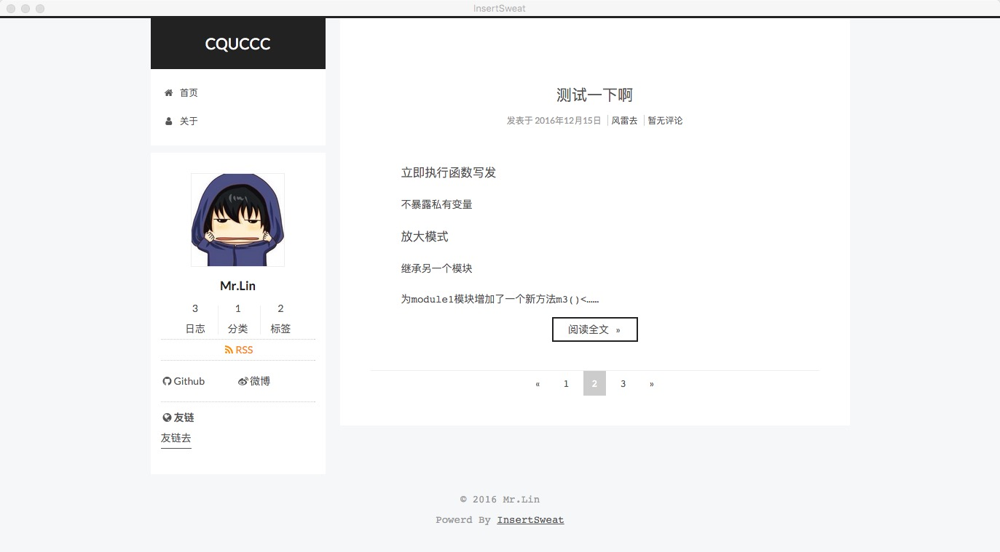

 
## Next for WordPress 前言
`Next for WordPress` 是根据[hexo-theme-next](https://github.com/iissnan/hexo-theme-next) 制作的，作者博客：[IIssNan](http://notes.iissnan.com/)。

本博客之前用`hexo`托管于`Github` 之上，用的Next主题 ，后因为hexo实在有些麻烦所以转到了WordPress上(原博地址：[insertSweat.github.io](http://insertSweat.github.io))。

我非常喜欢`Next`这款主题，所以开发了`Next for WordPress`主题。再此感谢[IIssNan](http://notes.iissnan.com/)。
<!--more-->
## 关于Next for WordPress
### 代码高亮
代码高亮方案 采用highlightjs 官网地址 [https://highlightjs.org/](https://highlightjs.org/)
### 评论系统
评论系统采用多说 ， <s>请自行在主题文件中更改多说 `shortname`</s>。

文章评论数也来自多说。

[16-12-24 更新] 自行在后台设置中填写多说的`shortname`。
### 图标库
图标库采用 `Font Awesome`  ,已集成WordPress插件 `Font Awesome` 。

主页菜单需要使用 ，请在菜单`css类`中填写 `Font Awesome`图标的css类，如果没有点击上方的`显示选项`并勾选`css类`。
### 添加归档页和标签页
新建一个页面模板选择`archive` 其他的随便写，然后发布，归档页就完成了。

同理标签页新建页面是选择`tags`模板。
### 添加社交联系方式
<s>在菜单页中新建菜单并取名为`social`</s>，然后添加用自定义链接的方式来添加社交选项，如`GitHub`。

[16-12-24 更新] 添加一个菜单，并将显示位置设为`社交`
### 添加友链
添加友链方式同上，<s>将菜单命名为`friendlink`即可</s>。
[16-12-24 更新] 添加一个菜单，并将显示位置设为`友链`
### 动画及其他的一些东西
动画啊什么之类的全部用的`CSS3`和<s>原生`JavaScript`</s>，因为感觉没有多少东西。

[17-1-8 更新] 改用`jQuery`

字体：`google fonts `  样式重置: `normalize.css`。

推荐使用`WP Markdown Editor`写文章
### 主题完全开源
这有点废话哈 ，肯定必须是开源的, `Github`地址[https://github.com/insertSweat/Next-theme-for-WordPress](https://github.com/insertSweat/Next-theme-for-WordPress)。
### 文章目录说明 [16-12-08更新]
<s>暂时只支持三级标题生成目录，用js实现的，暂时还么想到什么完美的解决方案 ，如果你想到了什么好的解决方案请给我留言</s>。

[16-12-28 更新]<s> 支持两级目录，第一级请使用二级标题，二级请示用三级标题。</s>

[17-1-8 更新]  改用自制的 `catalog.js`插件，具体信息查看此文章: [jquery-catalog.js 自动生成文章目录插件](http://www.cquccc.top/2017/01/jquery-catalog-js-%e8%87%aa%e5%8a%a8%e7%94%9f%e6%88%90%e6%96%87%e7%ab%a0%e7%9b%ae%e5%bd%95%e6%8f%92%e4%bb%b6/)
### 后台设置说明[16-12-24更新]
前面提过的不再赘述。

`站点作者名称`  侧边栏显示的站点作者昵称

`头像路径` 侧边栏站点作者头像路劲，请填写完整路劲，如`http://www.cquccc.top/avator.jpg`

`底部时间设置`  底部站点建站时间显示，如`2015-2016`。
## Next 主题记录
1. 2016年12月17日  Next 1.0 发布

          修复文章图片显示问题
          将评论统计改为多说
          增加阅读次数显示
          优化部分细节
2. 12月18日  更新  Next 1.1

         底部版权信息更新
         增加文章目录
         字体大小样式更新
3. 12月24日 更新 Next 2.0

         整体重构
         后台增加主题设置页面

----
### 写在最后
主题现在有很多不完善的地方，空有个样子。

欢迎大家给我留言交流，也可以带GitHub上提交。

如果你喜欢此主题不妨给个`start`。
